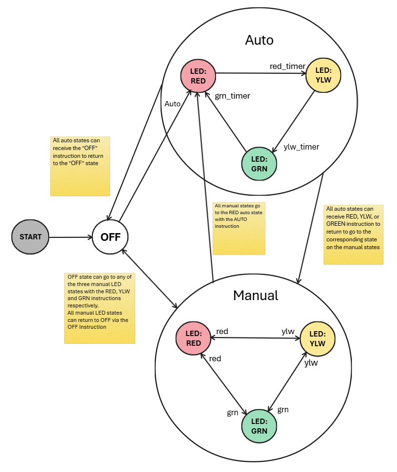

# Lab1: Wifi Stoplight (Raspberry Pi)

## Overview ##
This is my design document for the Wifi Stoplight project for the OIT systems academy Lab1

## Design Criteria ##

### Deliverables ###
1. Design the solution prior to coding
   - Create a state diagram modeling the system
   - Create a flowchart showing how the code for the system will flow
   - Create a design document showing the requirements, considerations, configurations, etc
2. Utilize source control to manage versions and track the development process of the system
3. Utilize generative AI for pair programming to develop the solution
4. Start with a MVP and iterate on it to fulfill the full criteria
5. Generate support documentation for:
   - *General Users*: How to connect to and use the system
   - *Operations Staff*: How to verify the system is working properly and how to troubleshoot
   - *Engineers*: Information about configurations, maintenance and design for future support

### Technical Requirements ###
The project should meet the following specifications
- Be built on Raspberry Pi
- Serve a webpage via webserver.  Said webpage should allow a user to:
   - Turn the system on/off
   - Change the lights manually to green, yellow, red and off
   - Change the lights automatically in a cycle to simulate a real stoplight

#### State Diagram ####
For the sake of readability, I have created this state diagram such that the larger circlers represent a "super state" to indicate that any of the states contained within can traverse to any of the states with arrows leaving the super state under the same criteria.  Said criteria is described in the nearest note.

#### Flowchart #####